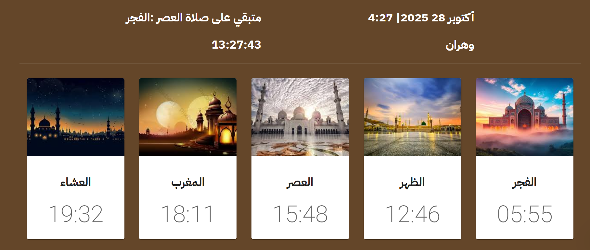

# 🕌 Prayer Times Web App (React)

A modern and responsive **React** web application that displays the **daily Islamic prayer times** based on the user’s location.  
It uses a **public Prayer Times API** and features a **clean UI**, **automatic location detection**, and **mobile-friendly design**.  
Built with React Hooks and deployed on **Netlify**.

🌐 **Live Demo:** [spectacular-seahorse-f1df2f.netlify.app](https://spectacular-seahorse-f1df2f.netlify.app/)

---

## ✨ Features

- 🕋 Displays **Fajr, Dhuhr, Asr, Maghrib, and Isha** prayer times
- 📍 **Automatic location detection** using browser geolocation
- 🗓️ Displays today’s date and prayer schedule
- 📱 Fully **responsive design** for all screen sizes
- ⚡ **Built with React Hooks** (useState, useEffect)
- ☁️ **Deployed on Netlify**

---

## 🧠 Technologies Used

- **React.js** — UI library for building components
- **CSS3 / Tailwind CSS (optional)** — responsive styling
- **JavaScript (Fetch API + Async/Await)** — for data fetching
- **Prayer Times API** — to retrieve real-time data
- **Netlify** — for deployment

---

## Photos



## 🚀 How to Run Locally

1. Clone this repository:
   ```bash
   git clone https://github.com/your-username/prayer-times-react.git
   ```
